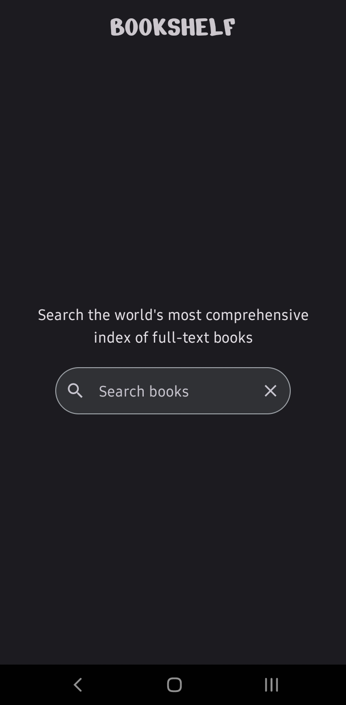
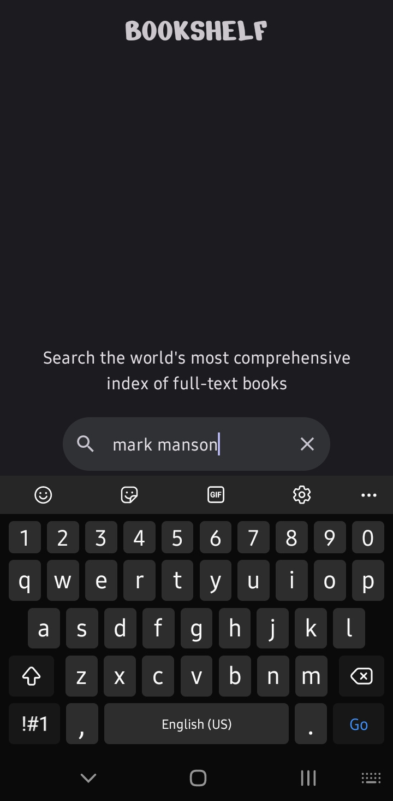
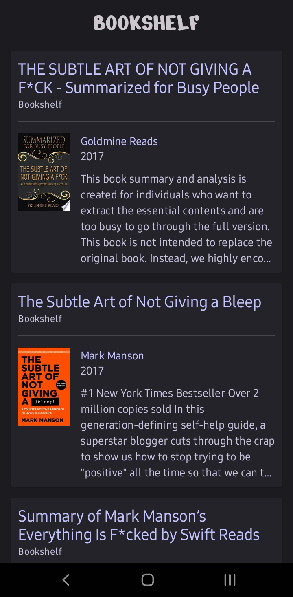

# Bookshelf
Bookshelf is an app that lets you explore and discover books using the Google Books API service. With its user-friendly interface, you can quickly search for books by title, author, or keywords and get well-organized results. 

During development, one of the main challenges was effectively fetching data from the Google Books API service. It turned out to be more complex than I anticipated, but I managed to conquer it by implementing Retrofit for network communication and using the ViewModel architecture. 

## Preview

    &nbsp;&nbsp;
    &nbsp;&nbsp;
    &nbsp;&nbsp;

